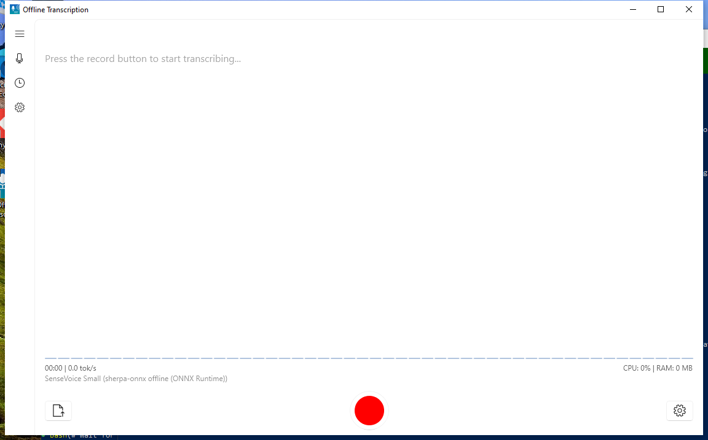
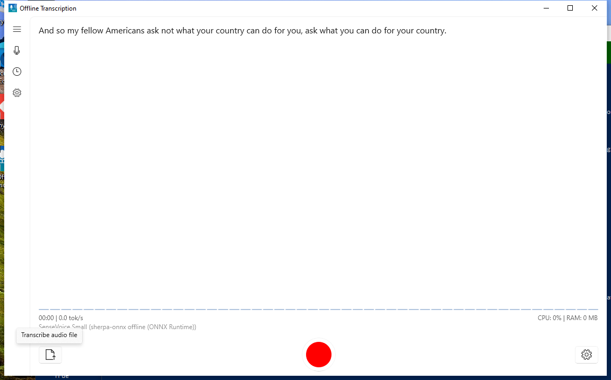
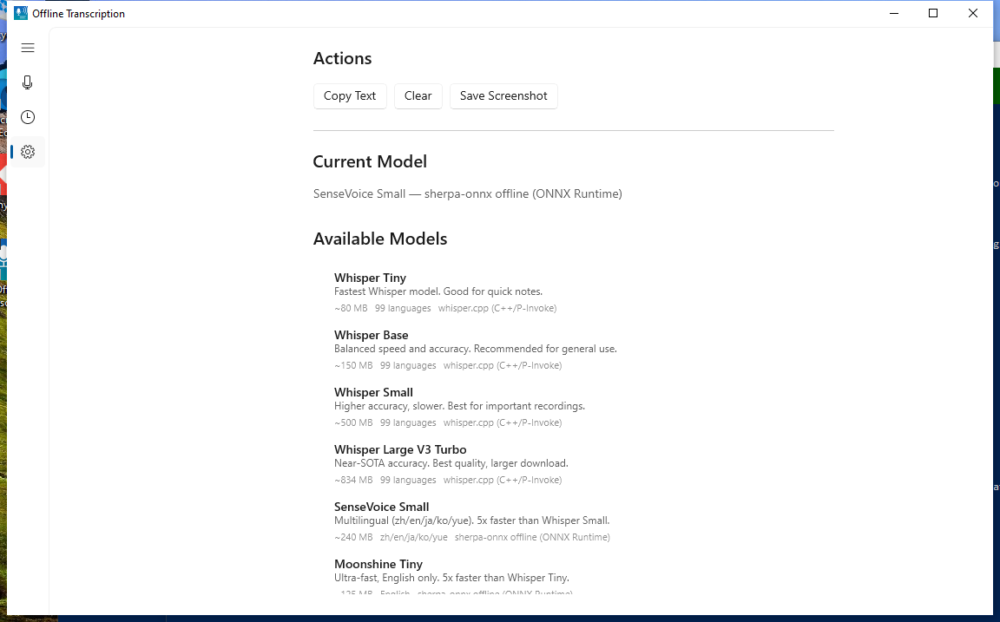
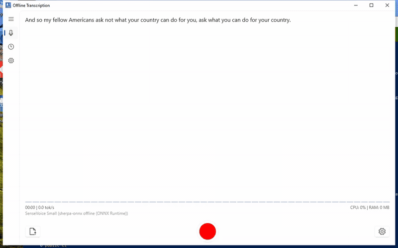
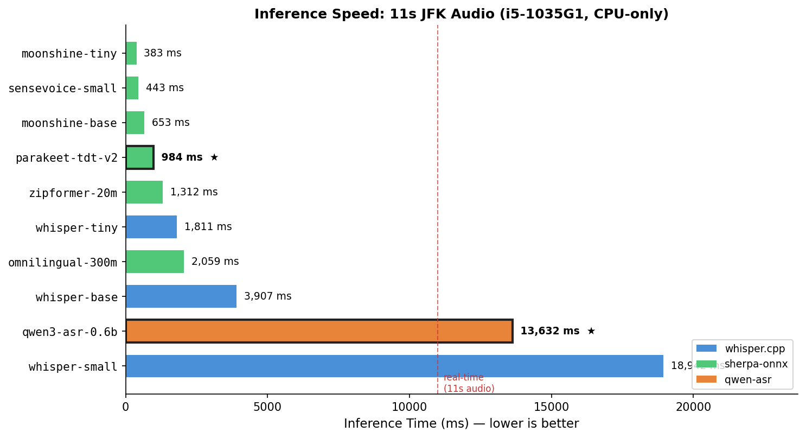
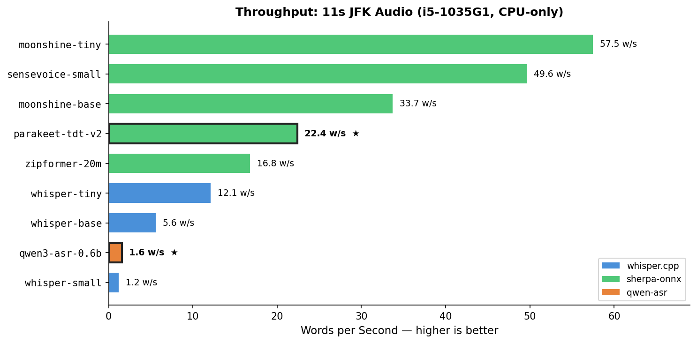

# Windows Offline Transcribe

WinUI 3 (Windows App SDK) desktop app for offline speech transcription.
All ASR inference runs locally after model download.

This repo also supports an optional **Translate** mode (offline MT + optional TTS) in the same app.

## Screenshots

| Main Screen | File Transcription | Settings |
|---|---|---|
|  |  |  |

### File Transcription Demo



Select an audio file (.wav / .mp3) and get the transcript in seconds — all processing runs locally.

## Current Scope (Code-Accurate)

- Live transcription with confirmed text plus rolling hypothesis.
- Two UI modes (left-nav):
  - `Transcribe`: transcription only.
  - `Translate`: transcription + offline translation + optional TTS playback.
- Audio source switching: `Microphone`, `System Audio (WASAPI loopback)`.
- In-app model download/load/switch (12 models across 5 engine types).
- File transcription (`.wav`, `.mp3`).
- Runtime stats while recording (`CPU`, `RAM`, `tok/s`, elapsed audio). Note: `tok/s` is a rough word-per-second estimate.
- History: saves transcript + session audio; export a shareable ZIP (text + metadata + audio).
  - Translate mode records may also include `translation.txt` and `tts.wav` in the exported ZIP.
- Diagnostics: `Evidence Mode` (events.jsonl + model manifests + screenshots; export one ZIP).

## Supported Models & Benchmarks

Defined in `src/OfflineTranscription/Models/ModelInfo.cs`.
Models are downloaded from Hugging Face at runtime and stored under `%LOCALAPPDATA%\\OfflineTranscription\\Models\\<model-id>\\`.

Benchmark: JFK inauguration excerpt (11s, 22 words). Device: i5-1035G1 (4C/8T), 8 GB RAM, CPU-only.

| Model ID | Engine | Params (weights) | Disk (download) | Languages | Inference | RTF | Words/s |
|---|---|---:|---:|---|---:|---:|---:|
| `moonshine-tiny` | sherpa-onnx offline | 27 M | ~125 MB | English | 383 ms | 0.035x | 57.5 |
| `sensevoice-small` | sherpa-onnx offline | 234 M | ~240 MB | zh/en/ja/ko/yue | 443 ms | 0.040x | 49.6 |
| `moonshine-base` | sherpa-onnx offline | 61 M | ~290 MB | English | 653 ms | 0.059x | 33.7 |
| **`parakeet-tdt-v2`** | **sherpa-onnx offline** | **600 M** | **~660 MB** | **English** | **984 ms** | **0.089x** | **22.4** |
| `zipformer-20m` | sherpa-onnx streaming | 20 M | ~73 MB | English | 1,312 ms | 0.119x | 16.8 |
| `whisper-tiny` | whisper.cpp | 39 M | ~80 MB | 99 languages | 1,811 ms | 0.165x | 12.1 |
| `whisper-base` | whisper.cpp | 74 M | ~150 MB | 99 languages | 3,907 ms | 0.355x | 5.6 |
| `omnilingual-300m` | sherpa-onnx offline | 300 M | ~365 MB | 1,600+ languages | 2,059 ms | 0.187x | — |
| **`qwen3-asr-0.6b`** | **qwen-asr (C)** | **600 M** | **~1.9 GB** | **52 languages** | **13,632 ms** | **1.239x** | **1.6** |
| `whisper-small` | whisper.cpp | 244 M | ~500 MB | 99 languages | 18,942 ms | 1.722x | 1.2 |
| `whisper-large-v3-turbo` | whisper.cpp | 809 M | ~834 MB | 99 languages | — | — | — |
| `windows-speech` | Windows Speech API | N/A | 0 MB | Installed packs | — | — | — |

- **Params (weights)** = number of trainable model parameters (e.g. 600 M = 600 million parameters).
- **Disk (download)** = approximate total download size for all model files (ONNX weights, tokenizer, config).
- **RTF** = Real-Time Factor (lower = faster). RTF < 1.0 means faster than real-time.
- **Bold** = recommended models.





Model weights are not distributed with this repo; model licensing varies. See `NOTICE`.

> **Want to see a new model or device benchmark?** If there is an offline ASR model you would like added, or you have benchmark results to share from your hardware, please [open an issue](https://github.com/voiceping-ai/windows-offline-transcribe/issues/new). Community contributions of inference benchmarks on different Windows devices are welcome.

## Engines / Inference Methods

This app has multiple inference paths:

### Live Recording (Microphone / Loopback)

- `sherpa-onnx streaming` (Zipformer):
  - True streaming decode (100 ms audio chunks).
  - Endpoint detection commits "confirmed" text on silence and resets the stream.
- `whisper.cpp` and `sherpa-onnx offline`:
  - Chunk-based loop while recording.
  - Window size: ~15 s for whisper.cpp, ~3.5 s for sherpa-onnx offline.
  - Optional VAD: skips work when recent audio energy is below a threshold.
  - Prefix-match between consecutive results to split confirmed text vs rolling hypothesis.

Provider selection:
- `sherpa-onnx offline` probes `DirectML` first and falls back to `CPU`.
- `sherpa-onnx streaming` uses `CPU` for stable real-time behavior.

### File Transcription

- Uses NAudio to decode audio, resamples to 16 kHz mono Float32, and runs a single engine pass.

### Qwen-ASR (C engine)

- `qwen-asr` (antirez/qwen-asr): native C engine for Qwen3-ASR models.
- Uses memory-mapped BF16 safetensors with OpenBLAS for inference.
- Requires compiling `qwen_asr.dll` from source (see Native Dependencies).

### Windows Speech API

- `WindowsSpeech`: built-in Windows recognizer via WinRT `SpeechRecognizer`.
- Works offline if the Windows language pack is installed.
- Limited accuracy compared to neural ASR models. No native DLLs required.

## Translate Mode

When you select **Translate** in the left navigation:

- The app runs offline machine translation (CTranslate2) on the live transcript.
- Translation is always active in Translate mode (there is no separate enable toggle).
- Optional: enable **Speak Translated Audio** (Windows.Media TTS). The app will stop recording during TTS playback to avoid feedback loops, then resume.

Translation settings:

- Configure `Source Language` and `Target Language` in Settings (Translate mode only).
- Translation models are cached under `%LOCALAPPDATA%\\OfflineTranscription\\TranslationModels\\`.

## Legacy Migration (Windows)

On first run, the app performs a best-effort migration from the legacy Windows app data folder
`%LOCALAPPDATA%\\OfflineSpeechTranslation\\` into `%LOCALAPPDATA%\\OfflineTranscription\\` when the new location does not already exist.

## Prereqs

- Windows 10/11 (x64)
- Visual Studio 2022 or newer
- .NET 8 SDK

## Native Dependencies

This app uses native engines via P/Invoke:

- whisper.cpp: `whisper.dll` (see `src/OfflineTranscription/Interop/WhisperNative.cs`)
- sherpa-onnx C API: `sherpa-onnx-c-api.dll` (see `src/OfflineTranscription/Interop/SherpaOnnxNative.cs`)
- qwen-asr: `qwen_asr.dll` + `libopenblas.dll` (see `src/OfflineTranscription/Interop/QwenAsrNative.cs`)
- offline translation (CTranslate2 wrapper): `OfflineTranscription.NativeTranslation.dll` (see `src/OfflineTranscription/Interop/NativeTranslation.cs`)
- Windows Speech: no native DLLs needed (WinRT API)

Place required `.dll` files in:

- `libs/runtimes/win-x64/`

They are copied to the build output directory by `src/OfflineTranscription/OfflineTranscription.csproj`.

If you use the sherpa-onnx release bundle, make sure you also include its dependent DLLs
(for example `onnxruntime.dll` and DirectML-related DLLs if applicable).

### Building `qwen_asr.dll` (Windows)

For qwen-asr, compile `qwen_asr.dll` from [antirez/qwen-asr](https://github.com/antirez/qwen-asr) source
and place alongside `libopenblas.dll` (from [OpenMathLib/OpenBLAS releases](https://github.com/OpenMathLib/OpenBLAS/releases)).

### Building `OfflineTranscription.NativeTranslation.dll` (Windows)

The native translation wrapper lives in `src/OfflineTranscription.NativeTranslation/` and is built with CMake.

1. Install a C++ toolchain (Visual Studio Build Tools) and CMake.
2. Build the DLL using the instructions in `src/OfflineTranscription.NativeTranslation/README.md`.
3. Copy the produced `OfflineTranscription.NativeTranslation.dll` (and any dependency DLLs) into:
   - `libs/runtimes/win-x64/`

## Build

Open `OfflineTranscription.sln` and build `x64` (`Debug` or `Release`).

## Diagnostics

- `Save Screenshot` writes PNGs under `%LOCALAPPDATA%\\OfflineTranscription\\Diagnostics\\`
- `Evidence Mode` writes under `%LOCALAPPDATA%\\OfflineTranscription\\Evidence\\` and can export a single evidence ZIP.

See `DEVICE_TESTING.md` for a real-device test checklist.

## Tests

```powershell
dotnet test tests/OfflineTranscription.Tests/OfflineTranscription.Tests.csproj -c Release
```

## Privacy

- Audio and transcription are processed locally.
- Network is used for model downloads only.
- Translate mode downloads offline translation model files on-demand.
- History and exported ZIPs may contain transcripts and audio.
- Evidence Mode can optionally include transcript text (toggle in Settings).

## License

Apache License 2.0. See `LICENSE` and `NOTICE`.
